# MCQ Quiz Generator

## Introduction

The MCQ Quiz Generator is a versatile tool crafted to assist educators and examiners in creating, modifying, and randomizing fact-based multiple-choice questions (MCQs) to ensure a varied testing experience. This innovative tool integrates ChatGPT to dynamically rephrase existing questions or to generate new ones, consistently testing the same concepts through varied phrasing.

## Table of Contents
- [Features](#features)
- [Planned enhancements](#plannedenhancements)
- [Programme usage](#programmeusage)
- [Programme details](#programmedetails)

<a id="features"></a>
## Features

### Dynamic Question Creation
- **Interactive Interface**: Easily add and update questions through an intuitive Python interface.
- **Integration with ChatGPT**: Leverage AI to enhance the variety of questions, rewording them or creating entirely new ones while maintaining the core concept.

### Randomization
- **Question/ options Shuffling**: Randomly shuffle the order of questions and options within a quiz to prevent predictability.

### Export Functionality
- **Document Export**: Export quizzes directly into Microsoft Word format, making it easier to edit.

<a id="plannedenhancements"></a>
## Planned Enhancements

### Features to work on
- **User-friendly interface**: Create a graphical user interface to make it accessible for all user levels.
- **Editing Capabilities**: Implement functions to edit and delete existing questions directly from the interface and to add images to the questions.

### Robustness and Reliability
- **Code Optimization**: Review and clean up existing codebase to enhance efficiency, readability and maintainability.
- **Comprehensive Error Handling**: Introduce error management strategies to address user input errors and system faults.
- **Integration Validity Checks**: Enhance the reliability of ChatGPT integration to handle potential API limitations and edge cases.

<a id="programmeusage"></a>
## Programme Usage
### Prerequisites
Before running the program, you need to install the necessary Python packages. You can do this via pip with the following commands:

```bash
pip install colorama
pip install openai
pip install pandas
pip install python-docx
```

###  To run programme

You have two options to start the MCQ Quiz Generator, depending on your preference for graphical interfaces or command line operations.

### Method 1: Using the Batch File
- Find the `run.bat` file in the root directory.
- Double-click `run.bat` to start the program automatically. Make sure you have the necessary permissions to run the file.

### Method 2: Using the Command Line
- Open a command prompt or terminal.
- Navigate to the program's directory:

  ```bash
  cd path/to/mcq-quiz-generator
  ```
- Execute the program:

  ```bash
  python main.py
  ```

<a id="programmedetails"></a>
## Programme Details

### Menu
The main menu offers five options. To select an option, enter a valid integer between 1 and 5.

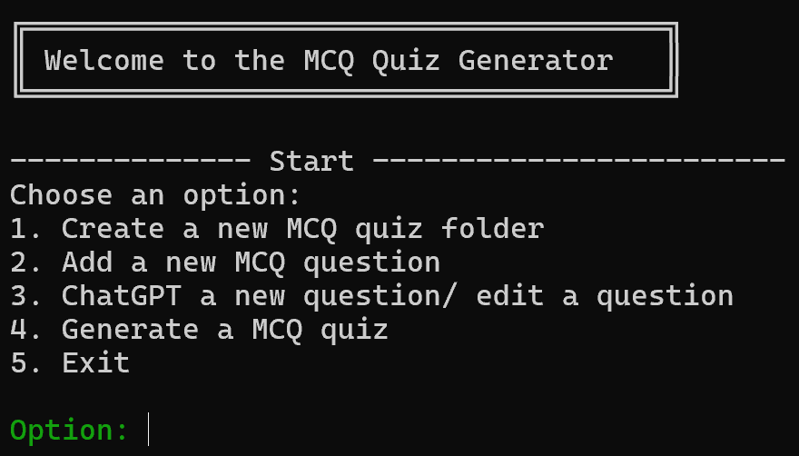

### 1. Create a new MCQ quiz folder
To create a new MCQ quiz folder:
- Enter `1` at the prompt.
- Specify the name of the quiz, which will also serve as the folder name (e.g., `test_quiz_folder`).

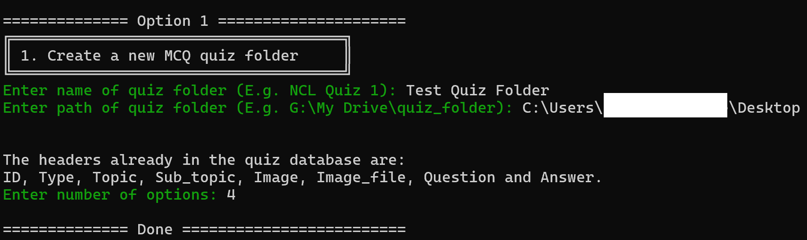

This action will establish the folder structure as follows:
- A primary folder named after your quiz.
- A subfolder for images.
- A CSV file to manage the quiz database.

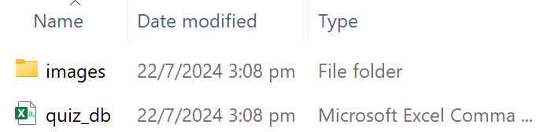

The quiz database includes predefined headers for organization:

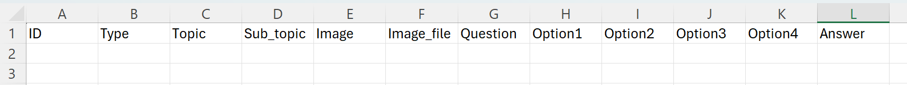

### 2. Add a new MCQ question
To add a new MCQ question:
- Enter `2`.
- Fill in the question details as prompted.

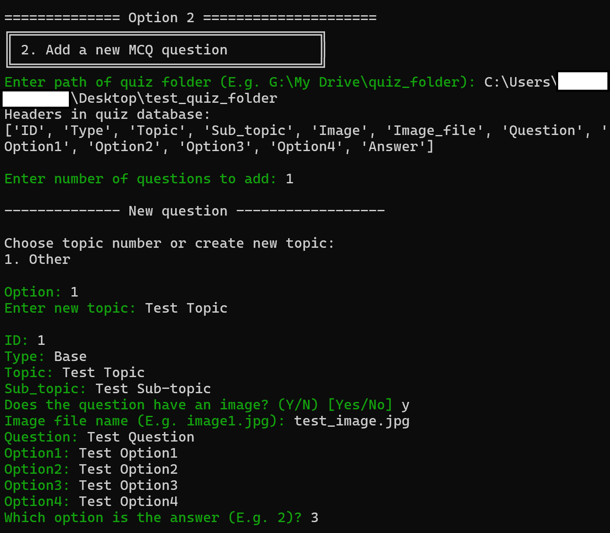

Review the entered information, and:
- Confirm to save the question to the database.
- Choose to delete or revise the question.

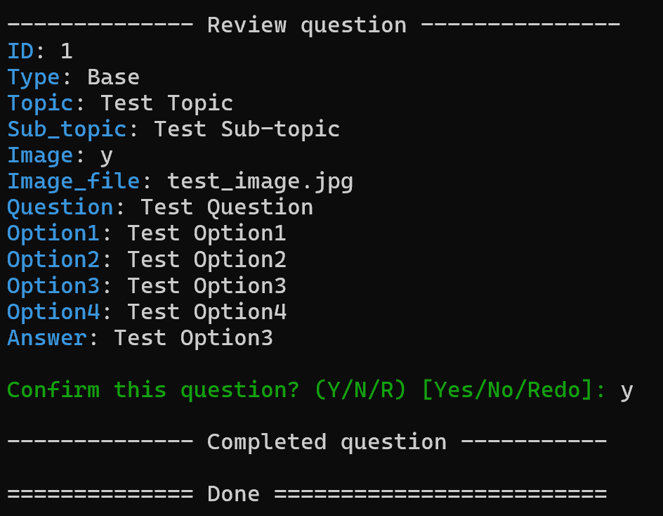

### 3. ChatGPT a new question/ edit a question
To generate or edit questions using ChatGPT:
- Enter `3`.
- Provide the necessary details for the quiz database and the specific question to modify.

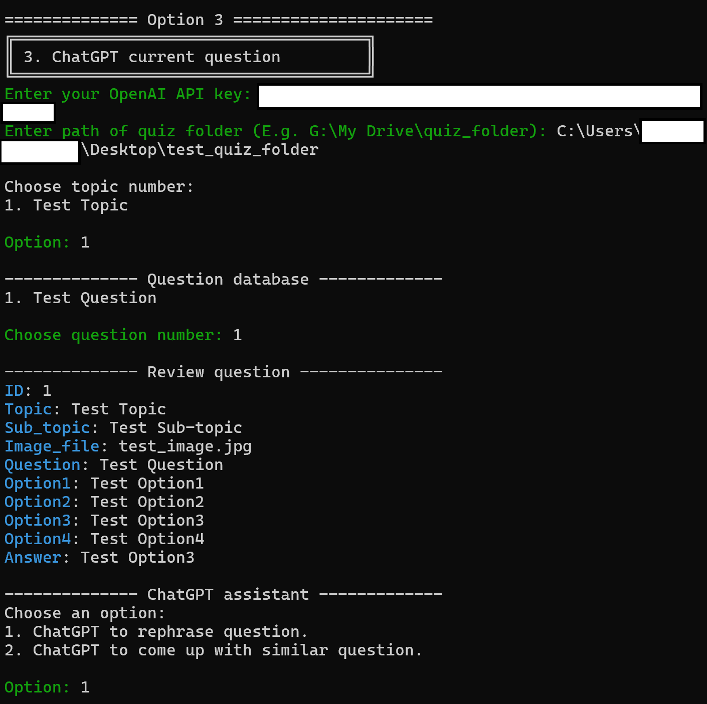

Review the suggestions from ChatGPT and decide whether to:
- Add the revised question to the database.

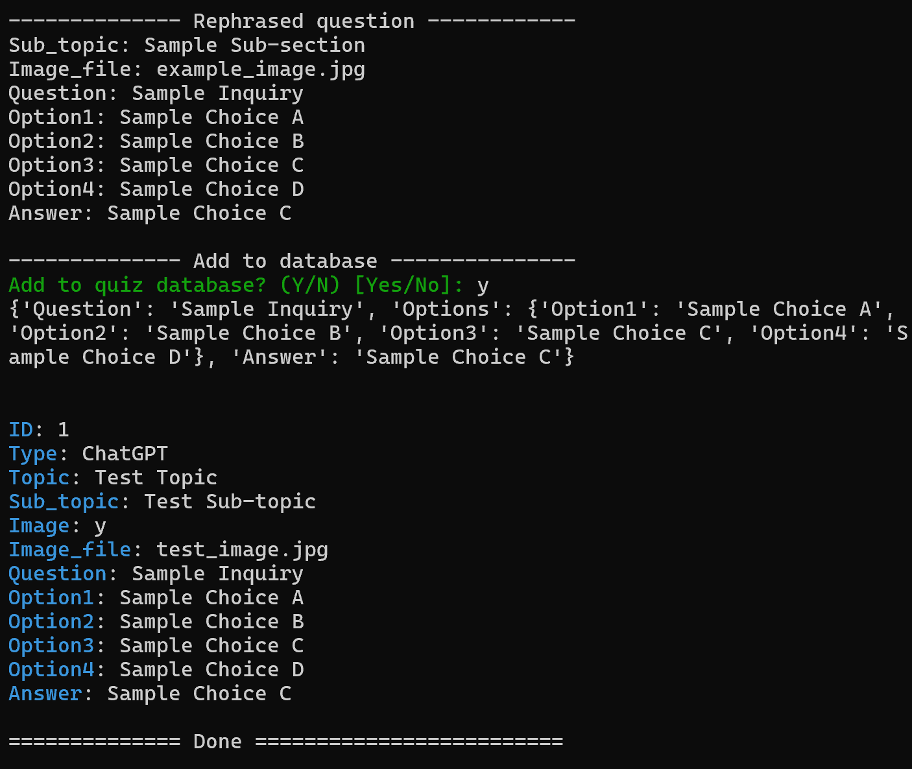

Questions modified or created via ChatGPT will be marked as `Type: ChatGPT`.

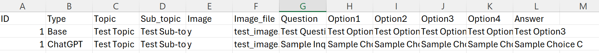

### 4. Generate a MCQ quiz
To generate an MCQ quiz document:
- Enter `4`.
- Input the necessary details for the quiz folder and document.

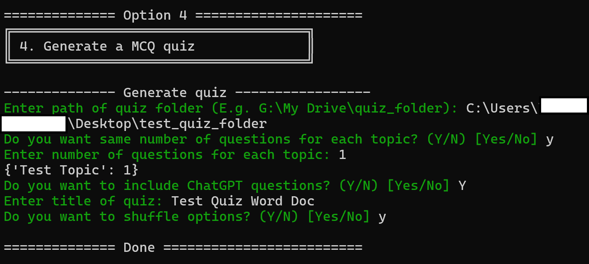

A Word document will be created in the quiz folder:

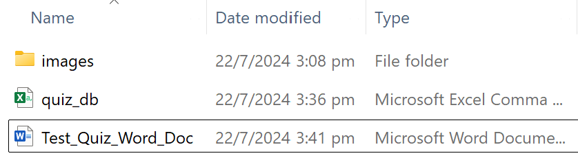

This document can be edited and formatted as needed:

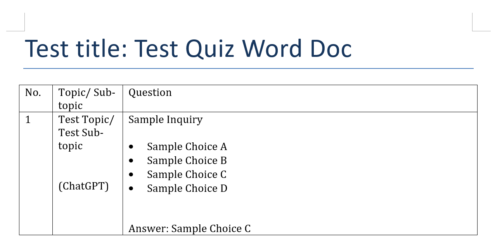

### 5. Exit
To exit the program:
- Enter `5`.

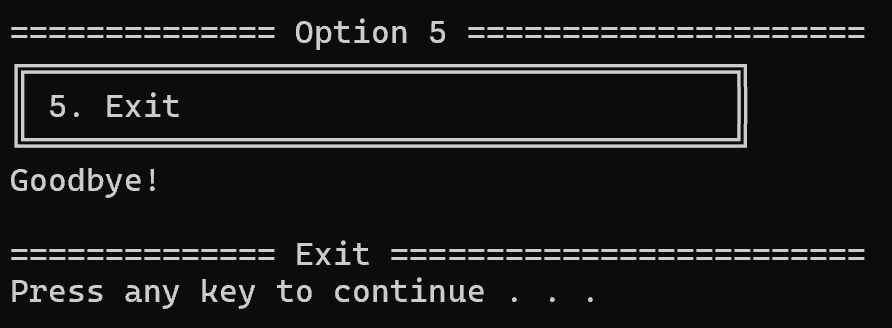

